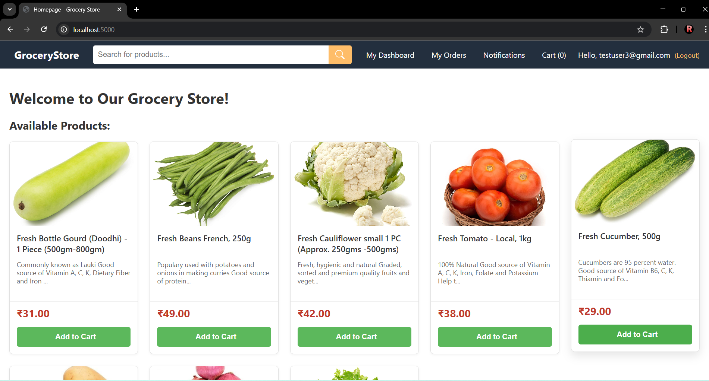

Welcome to GroceryStore, a feature-rich online grocery shopping platform built with Python, Flask, and Google Firebase. This project is designed to showcase skills in full-stack web development, including user authentication, product management, a shopping cart, and a complete payment gateway integration.

# GroceryStore - A Full-Stack E-commerce Web Application

 

Welcome to GroceryStore, a feature-rich online grocery shopping platform built with Python, Flask, and Google Firebase. This project is designed to showcase skills in full-stack web development, including user authentication, product management, a shopping cart, and a complete payment gateway integration.

---

## ✨ Features

### Customer-Facing Features:
- **User Authentication:** Secure user registration and login using Firebase Authentication. Includes a "Forgot Password" feature.
- **Product Browsing & Search:** Customers can view all available products on the homepage and search for specific items.
- **Shopping Cart:** A fully functional cart where users can add, update quantities, and remove products.
- **Smart User Dashboard:** 
    - **Shelf Life Tracker:** Tracks the expiry date of purchased products and displays their remaining shelf life with a progress bar.
    - **Automatic Notifications:** A background scheduler sends notifications to users 4 days before a product expires.
    - **Recipe Suggestions:** Users can get recipe ideas based on their recently purchased items using the Spoonacular API.
- **Order History:** Users can view a detailed history of all their past orders with status and item details.
- **Secure Payments:** Complete checkout process integrated with **Razorpay** in test mode.

### Admin-Specific Features:
- **Admin & Super-Admin Roles:** Role-based access control (RBAC) to protect sensitive admin routes.
- **Product Management (Admin):** Admins can add, edit, and delete products from the store.
- **User Management (Super-Admin):** Super-admins have the authority to promote users to 'admin' or demote them back to 'user'.

---

## 🛠️ Technology Stack

- **Backend:** 
    - **Python 3**
    - **Flask** (Web Framework)
    - **APScheduler** (For background jobs)
- **Database:** 
    - **Google Firestore** (NoSQL Database for product, user, and order data)
- **Authentication:** 
    - **Firebase Authentication** (For managing users)
- **Payment Gateway:** 
    - **Razorpay** (Integrated in Test Mode)
- **Frontend:** 
    - **HTML5**
    - **CSS3**
    - **JavaScript**
- **Templating Engine:**
    - **Jinja2**
- **External APIs:**
    - **Spoonacular API** (For recipe suggestions)
- **Deployment (Example):**
    - Vercel / Render / PythonAnywhere

---

## 🚀 Getting Started

To run this project locally, follow these steps:

### Prerequisites
- Python 3.x installed
- A Google Firebase project with Firestore and Authentication enabled.
- A Razorpay account with Test API keys.

### Installation & Setup

1.  **Clone the repository:**
    ```bash
    git clone https://github.com/your-username/your-repository-name.git
    cd your-repository-name
    ```

2.  **Create and activate a virtual environment:**
    ```bash
    # For Windows
    python -m venv .venv
    .\.venv\Scripts\Activate.ps1

    # For macOS/Linux
    python3 -m venv .venv
    source .venv/bin/activate
    ```

3.  **Install the required packages:**
    ```bash
    pip install -r requirements.txt
    ```

4.  **Set up your environment variables:**
    - Create a file named `.env` in the root directory.
    - Add your Firebase and Razorpay credentials to this file. Use the `.env.example` file as a reference.
    - **Important:** Add `.env` to your `.gitignore` file to keep your credentials safe!

5.  **Set up Firebase Credentials:**
    - Download your Firebase service account key JSON file from your Firebase project settings.
    - Rename it to `firebase-creds.json` and place it in the root directory.
    - **Important:** Also add `firebase-creds.json` to your `.gitignore` file.

6.  **Run the application:**
    ```bash
    python app.py
    ```
    The application will be running at `http://localhost:5000`.